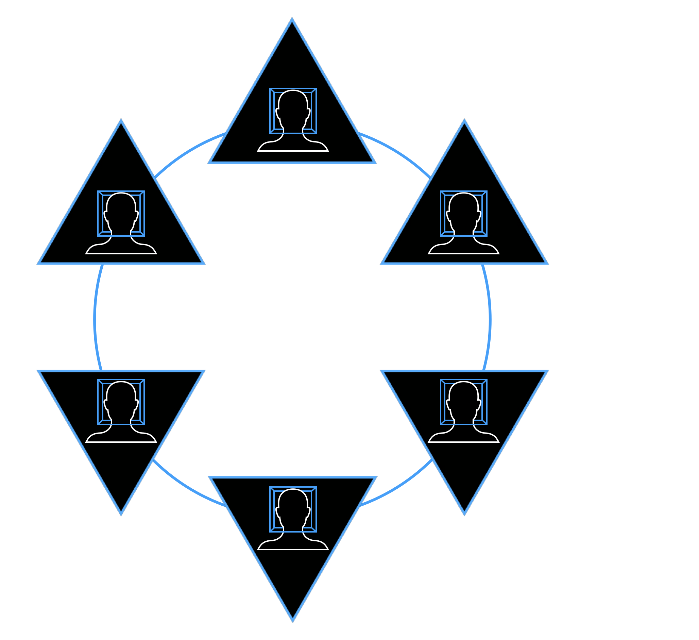

# GameTheory

Game theory studies the strategies and dynamics within finite games with clear rules and goals, where players optimize their actions to win against their competition.
When consciously confined to a clearly defined game with transparent rules like for example poker, this way of thinking is not problematic.
However, when players confuse finite games like poker, sports competitions etc. for the infinite game of life itself this way of thinking leads to a bottomless pit of unrestricted warfare where every other being is inherently seen as a competitor and threat thus eroding any possibility for meaningful collaboration other than mutually assured destruction type scenarios.
A classic example is the prisoner’s dilemma, where two prisoners, A and B, who were involved in the same crime, are given the choice between either defecting or cooperating with the other. In this context, defecting means providing incriminating information about the other to law enforcement to receive a reduced sentence. Cooperating means remaining silent to protect the other, even if it means facing the full penalty themselves. There are four possible scenarios:

(i) A and B cooperate
(ii) A cooperates, B defects
(iii) A defects, B cooperates
(iv) A and B defect  

In this thought experiment, scenario (i) is the most beneficial for both prisoners. Scenario (ii) and (iii) represent the worst cases for prisoner A and B respectively while option (iv) is less bad than being taken advantage of as in (ii) or (iii).
So if we look at the system as a whole, option (i) is clearly the best outcome for both parties and option (iv) much less so. If the two would act as one there would be no problem here and the choice would be clear.
But paradoxically, because they act as separate agents that can benefit at the cost of the other (options (ii) and (iii)) the fear of being taken advantage of drives them to defect on the other.
This way option (iv) is the scenario that reliably manifests in a purely game-theoretic environment where the lack of trust locks the system in to a state of much lower overall potential  referred to as a Nash-equilibrium (named after John Nash the father of game theory).
In this sense we can refer to game theory as the physics of fear that unavoidably erode the potential of any collective through coordination failure generating entropy and decay.
From this understanding it is clear that the fundamental quest for large scale coordination requires the overcoming of the physics of fear which can only happen by transmuting fear into love at scale

Example: https://youtu.be/31Voz1H40zI?si=m1IiWGvYvZHn2O6A&t=79
